# 云服务器部署 Node.js 前后端分离项目

## 准备工作

### 1.拥有一台服务器

自行选择阿里云，腾讯云.........

### 2.重装系统

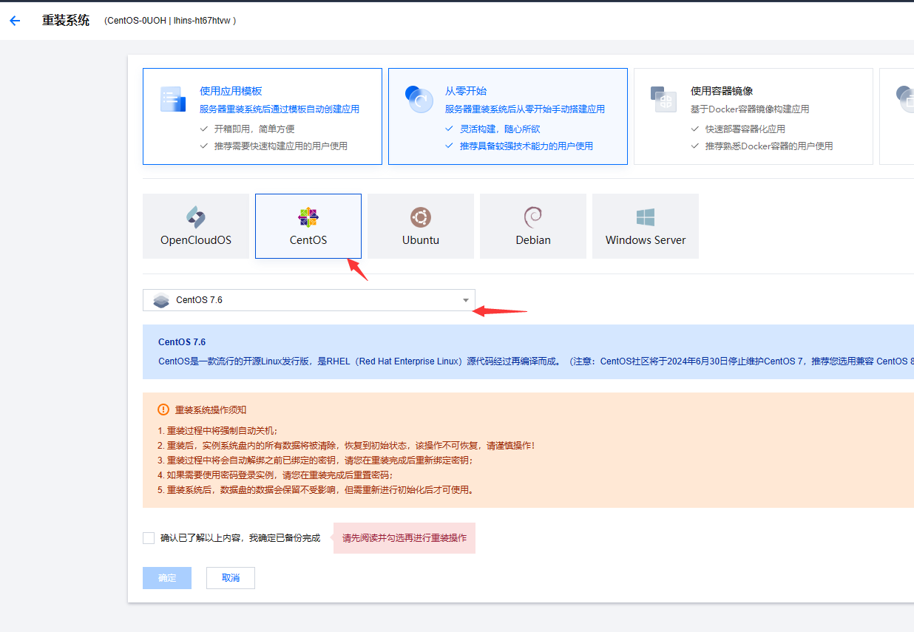

以腾讯云为例，安装 centos 7.6 系统

重置一下密码

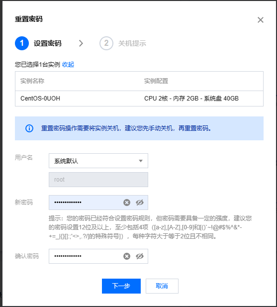

### 3.使用远程管理工具

以宝塔工具为例,添加连接

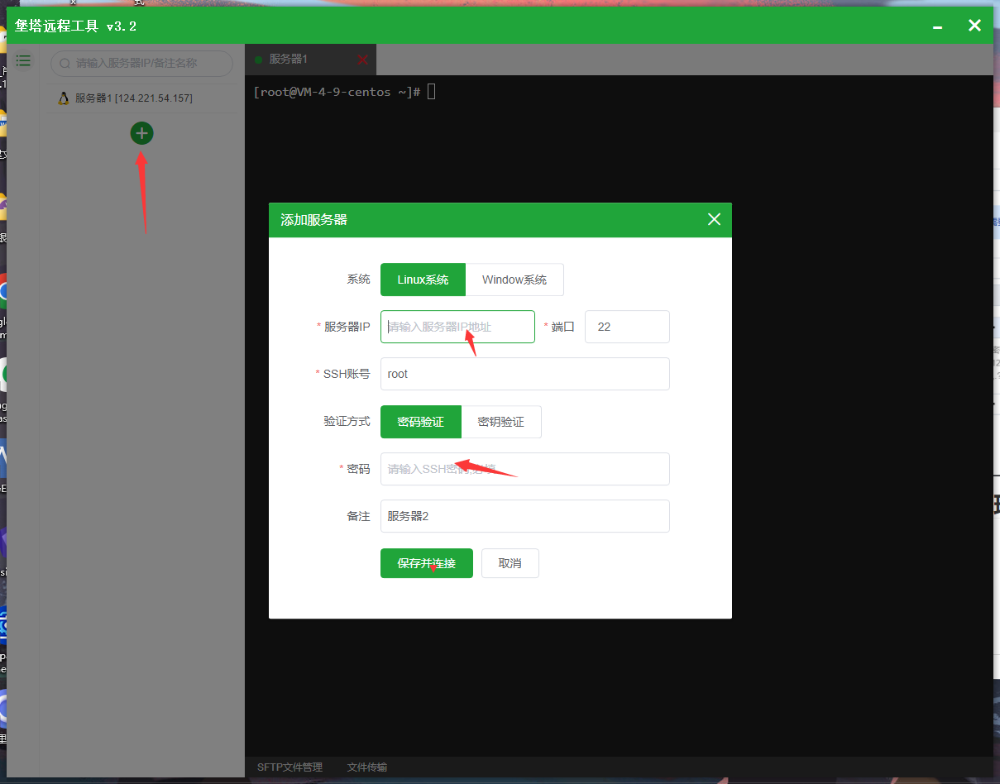

### 4.安装宝塔面板

[宝塔面板 - 简单好用的 Linux/Windows 服务器运维管理面板 (bt.cn)](https://www.bt.cn/new/index.html)

> yum install -y wget && wget -O install.sh https://download.bt.cn/install/install_6.0.sh && sh install.sh ed8484bec

等待安装，输入两个 y

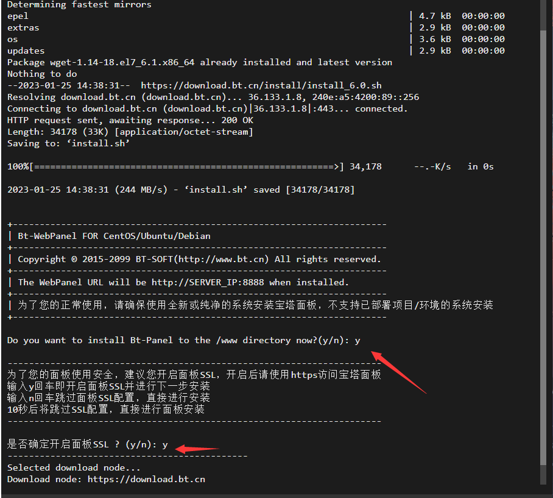

看到这样就安装好了

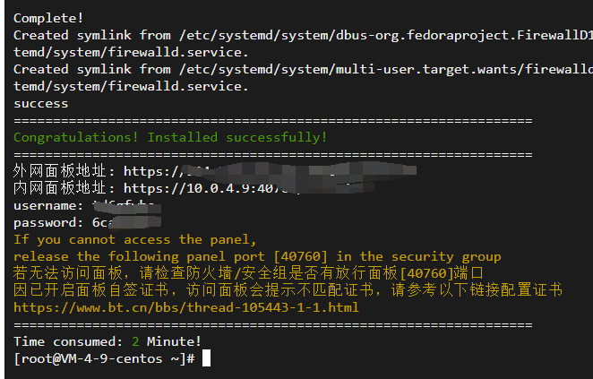

在服务器防火墙放行你的端口

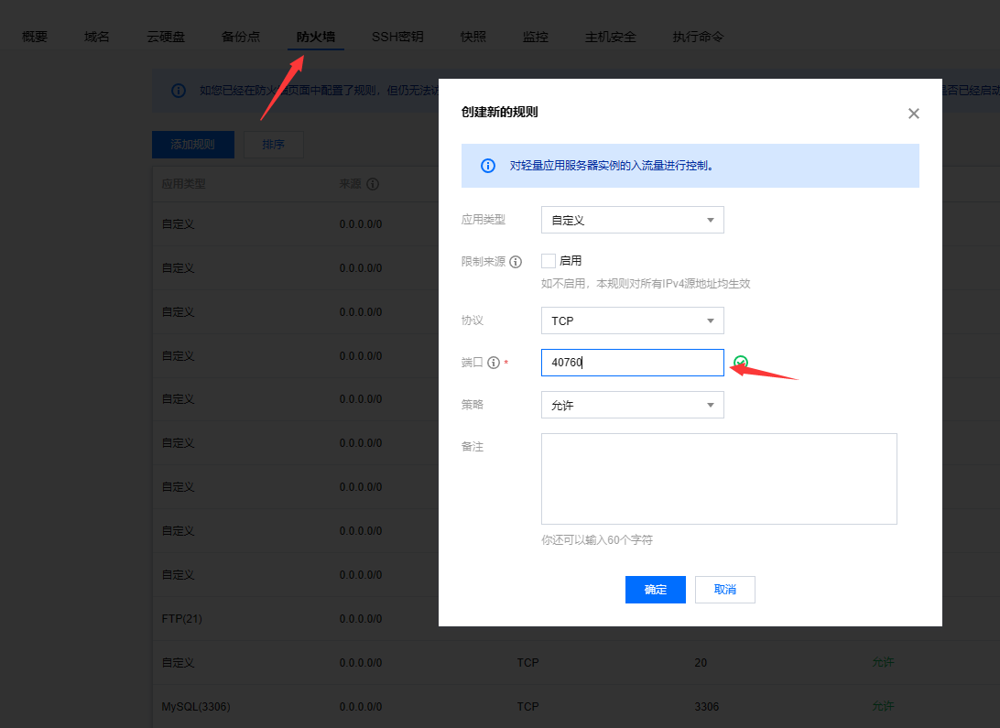

安装 LNMP 套件

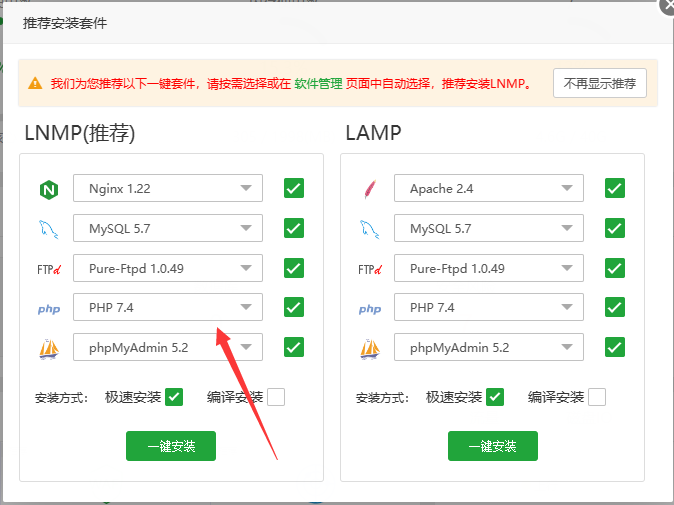

安装 PM2 管理器

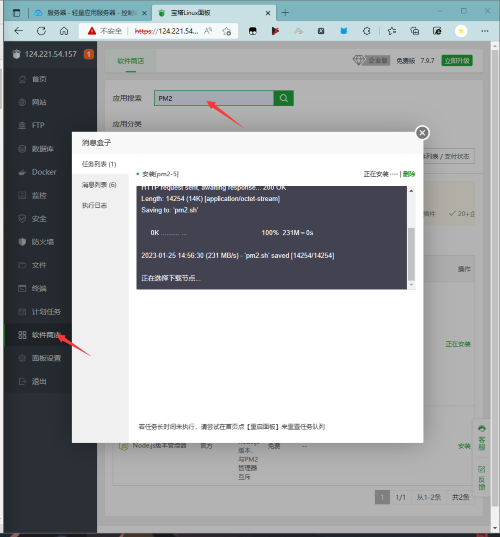

## 前端部署

### 添加站点

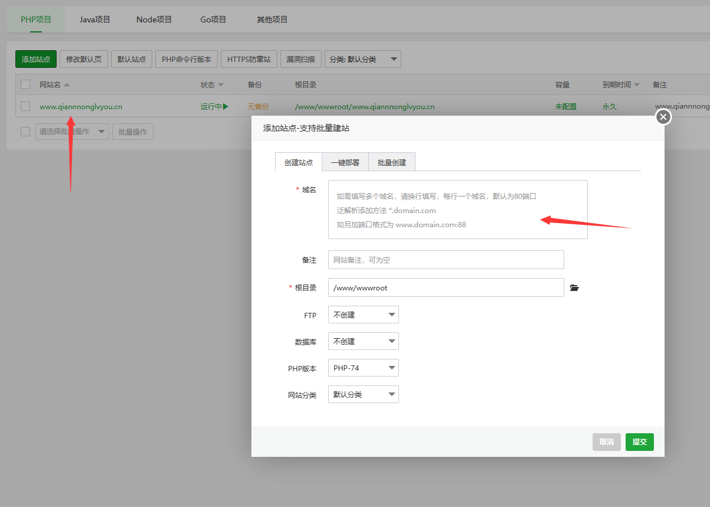

### 上传打包好的文件

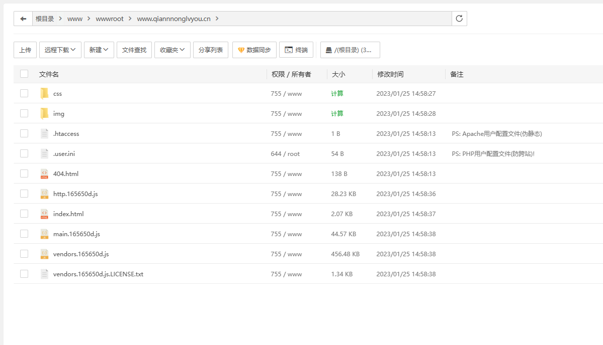

成功显示

## 添加数据库

选择自己的数据库类型并添加

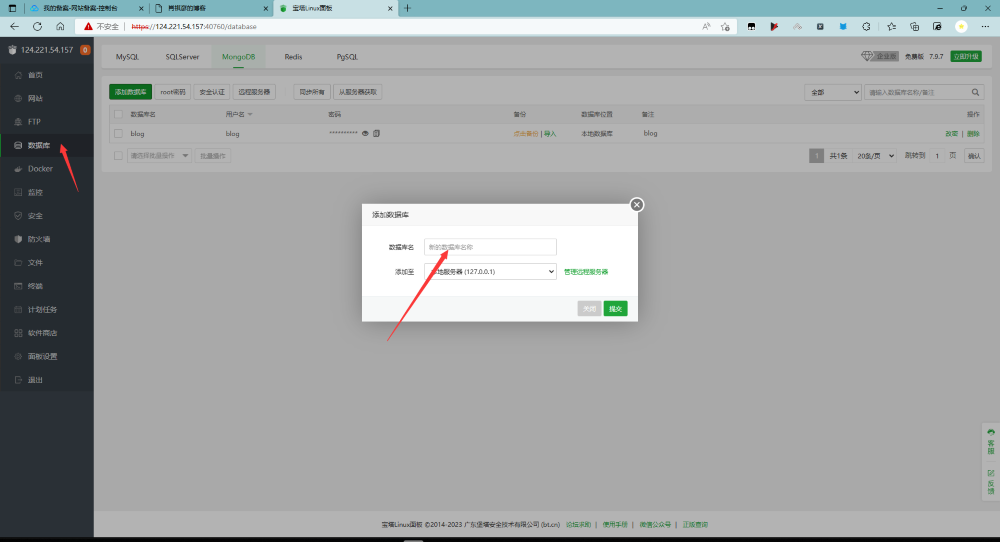

## 服务端部署

新建一个文件夹并上传文件

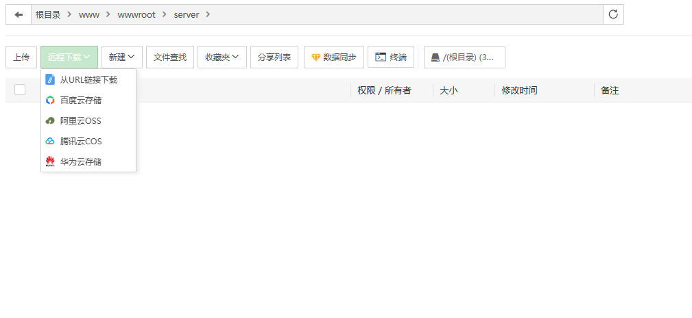

打开 PM2 管理器切换版本和本地版本一样

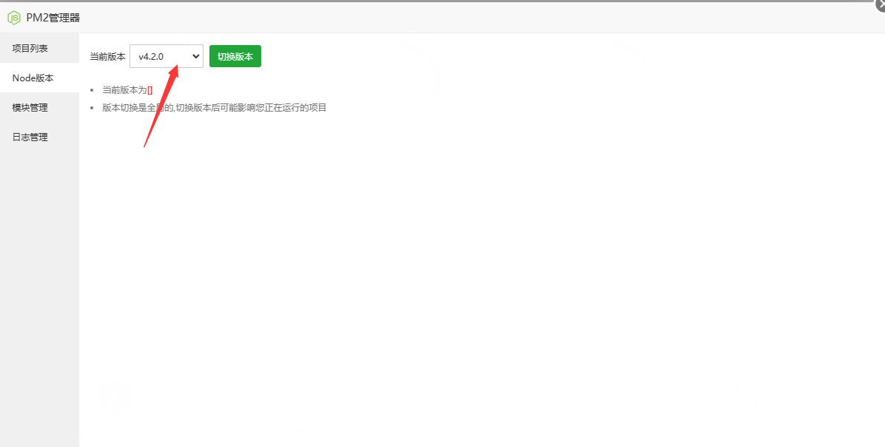

打开终端，输入

> node -v 查看版本
>
> npm install 安装依赖包
>
> npm install nodemon
>
> npm run start 启动项目

此时前端还访问不到，因为安全里面这个端口未打开

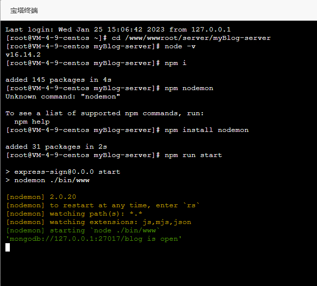

开启你自己设置的端口号

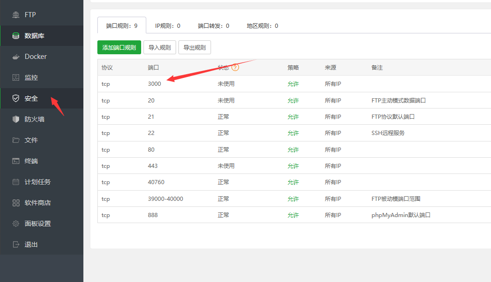

测试运行成功！！！

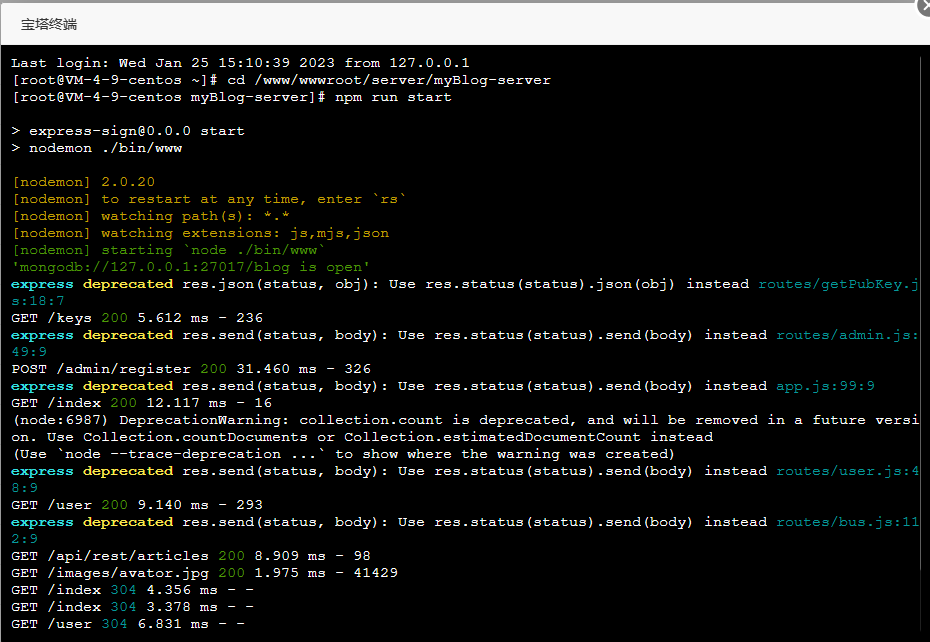

### 改用 PM2 管理

新建项目

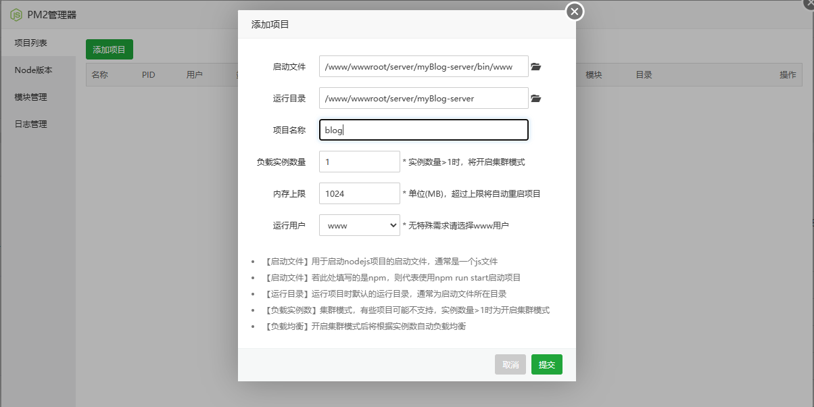

点击运行可以看到正常运行，数据库已连接

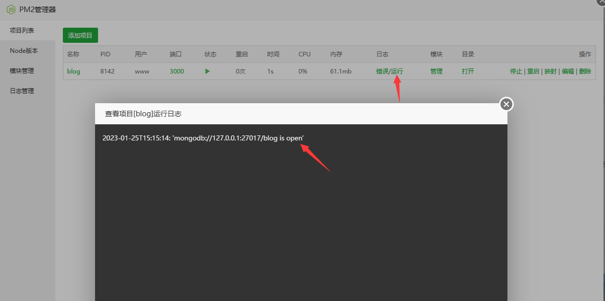

此时前端已经可以进行数据交互了
